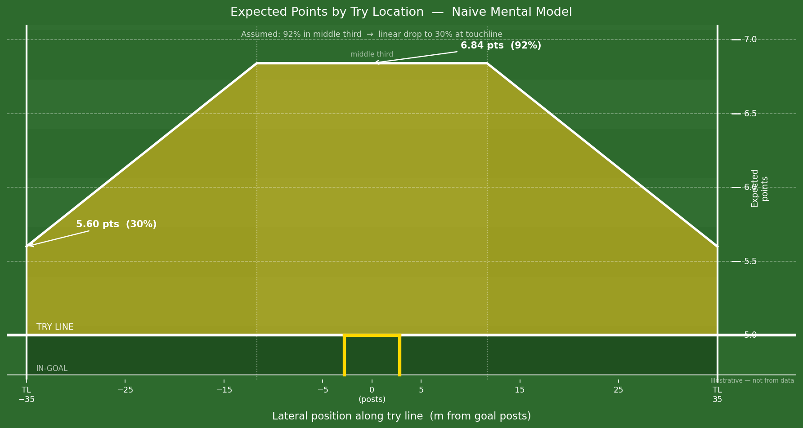
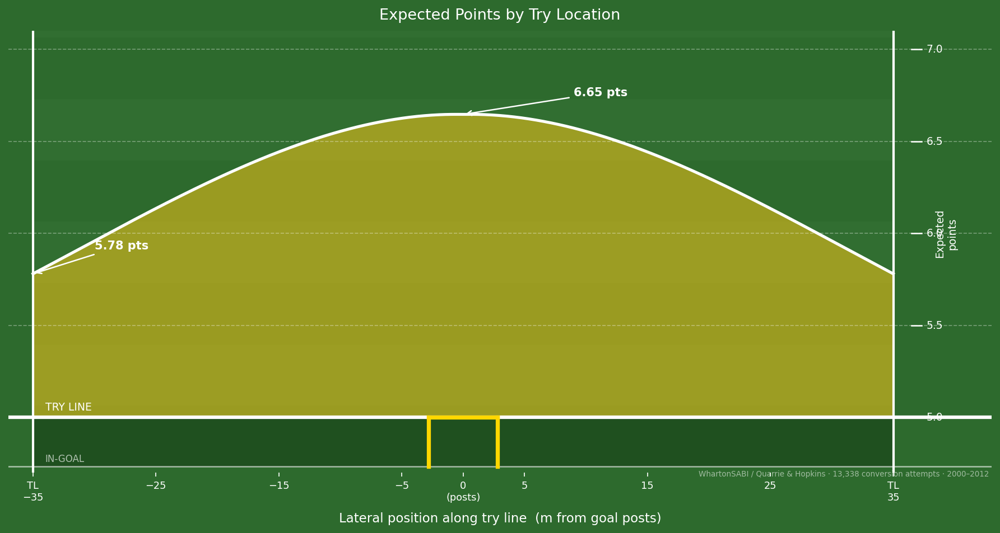

# Does Try Location Matter? I Looked at the Data.

A winger dives over in the corner. Crowd erupts. The commentator mutters something about "a difficult conversion from the touchline" — and then everyone quietly moves on, assuming the two points are gone.

I've always had a rough mental model of how much that matters. Watching the Six Nations earlier this year, I realised I'd never actually checked whether it was right. So I did.

---

## First, the rules

A try is worth 5 points, scored by grounding the ball anywhere between the touchlines. After a try, the scoring team gets a conversion attempt worth 2 bonus points.

Here's the key rule that makes rugby different from American football: the kick must be taken from a point in line with where the try was grounded — but the kicker can move as far back from the try line as they like. That means wider tries don't just mean harder kicks. They create an *optimisation problem*. Step too close and the angle is brutal. Step too far back and the distance kills you. There's a sweet spot, and elite kickers find it.

---

## What I assumed going in

Before looking at any data, here's the mental model I had:

My intuition: around 92% in the central zone, dropping steeply and roughly linearly to maybe 30% at the touchline. If that were true, try location would be enormously consequential — corner tries would be a significant tactical concession, and players should be fighting hard to get central.

It felt reasonable. Touchline conversions look hard. Commentators treat them as a bonus when they go over. Surely the numbers back that up?

---

## Why location should matter

Before getting to the data, it's worth understanding the geometry. The wider you score, the narrower the angle to the posts, and the harder the kick. There's a classic result here — for any lateral offset from the posts, there's an optimal distance back that maximises the angle subtended by the crossbar. Kickers implicitly solve this every time they pace back.

But geometry is just the floor. On top of it sits kicker skill, wind, pressure, fatigue. The question is what all of that looks like in aggregate, across thousands of real kicks.

---

## The data

I used the [Quarrie & Hopkins dataset](https://github.com/WhartonSABI/rugby-ep) (via WhartonSABI): 13,338 conversion attempts from international and top-tier matches between 2000 and 2012. Each attempt already reflects the kicker's own choice of how far to step back — so the empirical success rate at any given lateral position represents the best-case outcome a kicker can achieve from that spot, not a fixed-distance estimate.

To smooth out noise, I binned attempts by lateral distance in 2.5 m windows, computed the conversion rate in each bin, and fit a weighted cubic spline — weighting each bin by the square root of its attempt count so that high-traffic zones near the posts carry more influence than sparse bins at the edges.

One caveat upfront: this data is 20+ years old. Kicking technique has moved on significantly since then — dedicated kicking coaches, GPS-tracked biomechanics, structured pre-kick routines. If anything, the modern game has probably compressed the touchline penalty further. But it's the best public dataset available, and the patterns are still instructive.

---

## What the data actually shows

The curve runs from about **5.78 expected points at the touchline** up to **6.65 points directly under the posts** — a gap of roughly **0.87 points**.

The penalty is real. In a sport regularly decided by a single score, almost a point of expected value from try location is not nothing. But it's also not the lottery my intuition implied.

Here's where my mental model was wrong, and how:

- **Central rate**: I assumed ~92%. The data says ~82%. I overestimated how automatic central conversions are.
- **Touchline rate**: I assumed ~30%. The data says ~39%. I underestimated what elite kickers can do from wide.

The stepping-back rule does real work here. A kicker at the touchline doesn't have to kick from the try line — they pace back to find a better angle, partially clawing back the geometric disadvantage. My intuition ignored that entirely.

---

## So what do you do with this?

Honestly? Mostly nothing — and that's the point.

Tries are opportunistic. Players almost never get to choose where they score; the corner is often the only gap available. Knowing that a central try is worth ~0.87 points more than a touchline try doesn't change the calculus in the moment. You take the gap you're given.

The one exception is an attacking line break near the posts, where a player *might* choose to cut inside rather than angle for the corner. Even then, the expected gain from going central is less than a point — almost certainly not worth a harder line or the risk of losing the try entirely.

**Trust your winger. Trust your kicker.**

---

## The scenario where it sharpens: down by 6

There is one situation where try location stops being background noise and becomes a genuine decision: you're down by 6, late in the game. A try brings you to −1. The conversion wins it.

Now it's not about expected value — it's about win probability. And a 43 percentage-point swing in conversion rate (82% vs 39%) is a 43 percentage-point swing in winning the match.

The right frame: if you have an equally easy path to score centrally, take it. But don't sacrifice the try itself chasing a better angle. A missed try scores zero. A touchline conversion still wins you the match ~40% of the time — and that's a number worth knowing.

---

## The American football comparison

In the NFL, the point after touchdown is kicked from a fixed spot — the 15-yard line — regardless of where the touchdown was scored. Corner of the end zone or dead centre, the conversion odds are identical (~94% at NFL level).

Rugby's moving-kick rule is a deliberate design choice that partially compensates for wide tries, and the data shows it works. It's a clever bit of rule design: fix the lateral line, free the distance, and let kickers solve the optimisation problem themselves. The penalty for a corner try is real but bounded — which is probably about right.

---

## Caveats

**Data age.** 2000–2012 predates modern kicking specialists and GPS biomechanics. Rates have likely shifted since.

**Aggregation.** All kickers are collapsed into one curve — Beauden Barrett and a prop filling in are weighted together. The spread around any position is probably wide.

**No conditions data.** Wind, altitude, rain — none of it is controlled for.

**Selection effects.** Kickers may attempt from more optimal positions in comfortable games. The empirical rate is a best-case estimate, not a clean one.

The ideal follow-up: break this down by kicker, competition, and era. That dataset may not be publicly available, but it's the right question.

---

## What I think now

My prior was wrong at both ends. Central kicks are harder than I assumed; touchline kicks are better than I assumed. The gap is real — about 0.87 points of expected value, meaningful in close games — but the stepping-back rule compresses it significantly compared to what pure geometry would predict.

The broader lesson is simple: intuitions about sport are often wrong in systematic ways, and they're usually worth checking. Rugby's conversion rule turns out to be cleverly designed. And touchline kicks turn out to be more make-able than the commentary box suggests.

Code: [github.com/tyler-martin-12/rugby-conversion-public](https://github.com/tyler-martin-12/rugby-conversion-public)